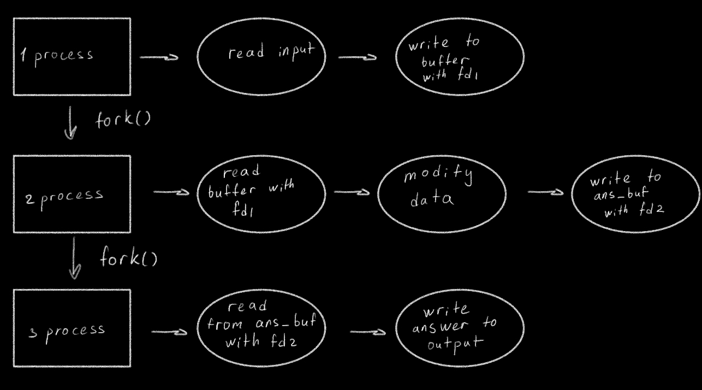

# Романчукевич Марина Александровна БПИ227
## Вариант 4
Разработать программу, находящую в заданной ASCII–строке последнюю при перемещении слева направо последовательность из N символов, каждый элемент которой определяется по условию «больше предшествующего» (число N вводится как отдельный параметр).

Выполнено на 4 балла
Схема
--------------------------------------------------------------------

Вызовы программы для разных тестов:
--------------------------------------------------------------------
gcc main.c
./a.out input1.txt output1.txt 4

gcc main.c
./a.out input2.txt output2.txt 5

gcc main.c
./a.out input3.txt output3.txt 10

gcc main.c
./a.out input4.txt output4.txt 6

gcc main.c
./a.out input5.txt output5.txt 7
